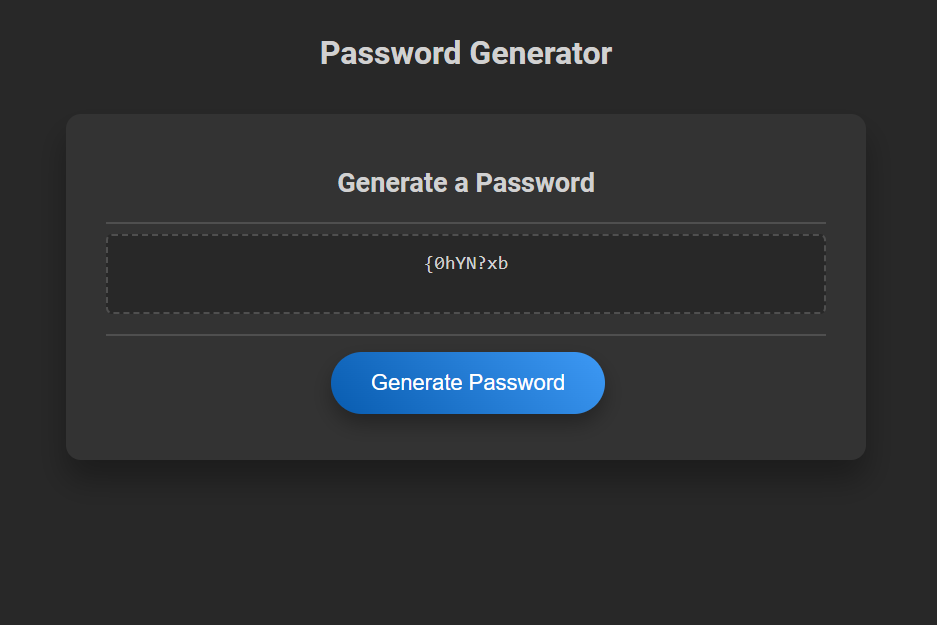

# Password Generator

This project is a simple password generator built using HTML, CSS, and JavaScript. It is designed to create a secure password based on user preferences for password length and character types.

## Table of Contents

- [General Info](#general-info)
- [Technologies](#technologies)
- [Installation](#installation)
- [Usage](#usage)
- [Screenshot](#screenshot)
- [Deployed Application](#deployed-application)
- [License](#license)

## General Info

The password generator allows users to generate a password that fits their security needs by selecting from a variety of character types including uppercase and lowercase letters, numbers, and special characters.

## Technologies

Project is created with:
* HTML5
* CSS3
* JavaScript

## Installation

To run this project, simply clone the repository and open the `index.html` file in a web browser.

```bash
$ git clone https://github.com/dustinii/pw-gen-js.git
```

## Usage 

1. Open the Password Generator in your web browser.
2. Click on the "Generate Password" button.
3. Follow the prompts to select your password preferences.
4. After all selections are made, your password will appear in the box.

## Screenshot



## Deployed Application

The Password Generator is deployed at https://dustinii.github.io/pw-gen-js/.

## License

This project is open source and available under the [MIT License](LICENSE).